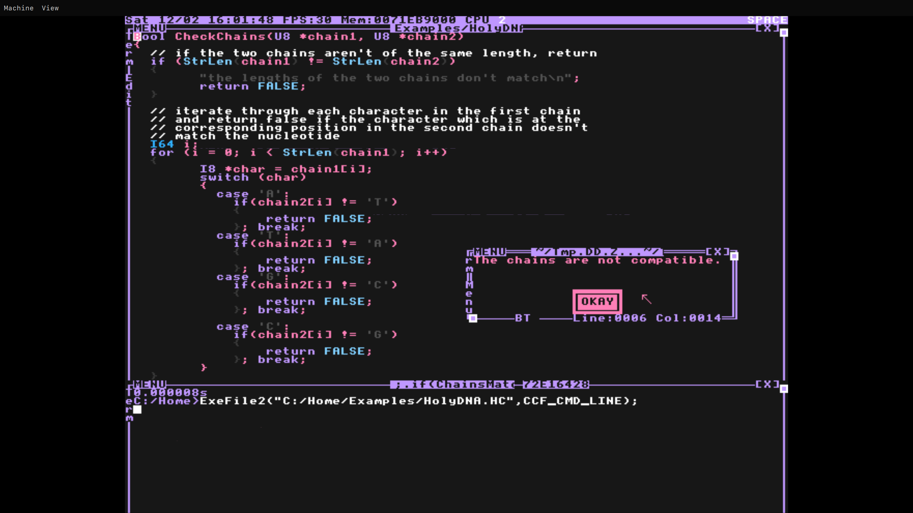

# Setup for Advent of Code 2023 in HolyC



_Colorscheme I use: [./Home/Theme.HC](./Home/Theme.HC)_

_Basically my attempt of making an [oxocarbon](https://github.com/nyoom-engineering/base16-oxocarbon) port on TempleOS_

## Quick Start

### Dependencies

- [QEMU](https://www.qemu.org/)
- [rsync](https://rsync.samba.org/)

### Configuration

QEMU flags, the name of the image and other QEMU options are defined in the `configuration` function in the `pray.sh` script. You can edit it to your liking.

### TempleOS Installation

```console
$ ./pray.sh install
... Follow the Installer instructions, but don't reboot at the end. Just close the VM ...
$ ./pray.sh sync temple
```

### Running

```console
$ ./pray.sh run
```

### Sync the Home between the Host and the Temple

When using sync, you must specify the target to which you want to sync. This could be either `host` or `temple`.

#### From Host to Temple

For example, if you create a new file in the `Home` directory on the host, you can sync it to the TempleOS virtual image with:

```console
$ ./pray.sh sync temple
```

#### From Temple to Host

```console
$ ./pray.sh sync host
```

### New Day

To create a new day:

```console
$ ./pray.sh newday Day1
```

_Note: after running the newday command, syncing is not required, so you can just use `./pray.sh run` to run the virtual machine with the new day directory added._

### Examples

In the [./Home/Examples](./Home/Examples) directory you can find some examples of HolyC code I wrote.

## Credits

This repository is almost entirely based on [Tsoding's AOC 2021 repo](https://gitlab.com/tsoding/aoc-2021), which I only modified to fit my needs, so all credits go to him.
